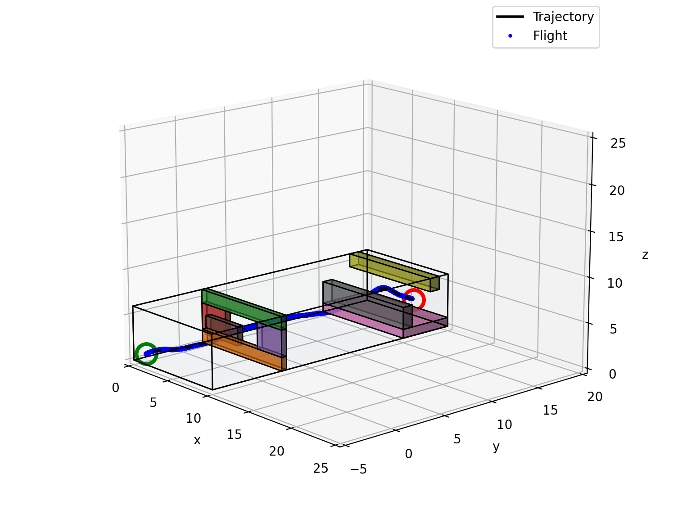

# Autonomous VIO-based Quadrotor
This project is the simulation of Stereo Visual Inertial Odometry (VIO) on a quadrotor modeled from [CrazyFlie 2.0](https://www.bitcraze.io/products/old-products/crazyflie-2-0/). In the simulation, the quadrotor is set up with an on-board IMU and a stereo camera rig. 
<p align="center">
  
</p>
## Pipeline
* A\* algorithm for shortest path searching and minimum snap for trajectory smoothing
* Geometric Nonlinear Controller for trajectory tracking 
* RANSAC for robust feature matching given stereo correspondences to recover camera pose 
* Error State Kalman Filter to acquire accurate quadrotor pose estimation

## Run
* Setup the environment
```bash
  pip install .
```

* Run VIO simulation

```bash
  python sandbox.py
```

* New maps can be customized through JSON file and saved under ``proj/util/``. 

## Examples
* Shortest path generated by A\* algorithm, pruned waypoints and smoothed trajectory
<p align="center">
  
</p>
* Trajectoy tracking
<p align="center">
  
</p>
